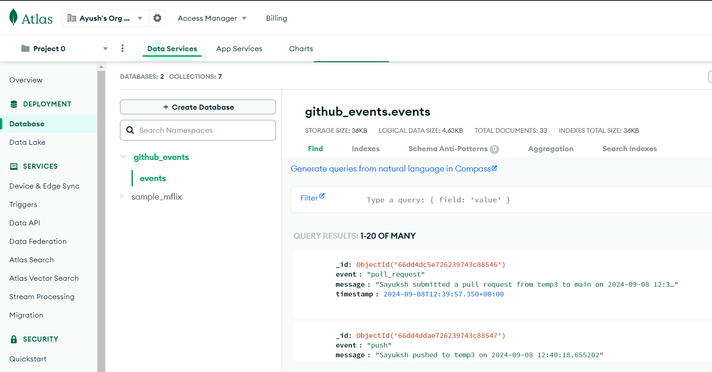
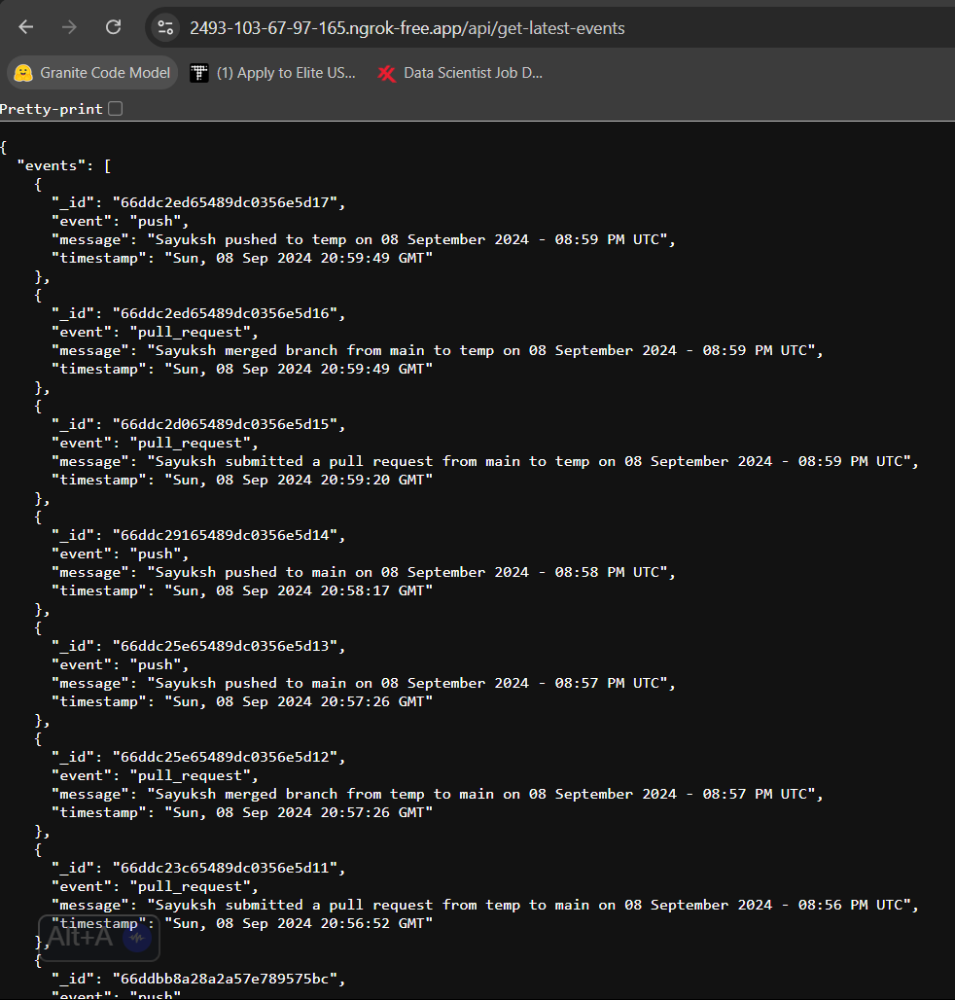
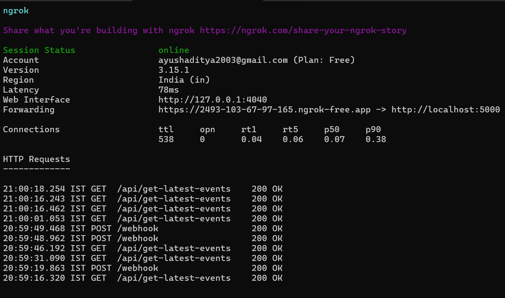

# task-assignment-webhook
This is the TechStax Assesment which is to create github webhook
## Setup

* Create a new virtual environment

```bash
pip install virtualenv
```

* Create the virtual env

```bash
virtualenv venv
```

* Activate the virtual env

```bash
source venv/bin/activate
```

* Install requirements

```bash
pip install -r requirements.txt
```

* Run the flask application

```bash
python app.py
```

# Database (MongoDB)
<>

# GitHub events in JSON
<>

# GitHub events in UI
<>

# Ngrok Teminal 
<>